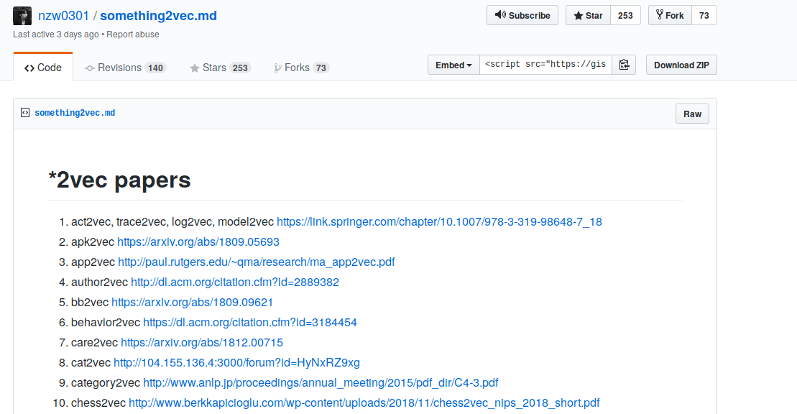

```{r xaringan-themer, include = FALSE}
library(xaringanthemer)
mono_accent(base_color = "#43418A")
```

# Introduction - Graph Data

.pull-left[
]

--

.pull-right[]

---

# Introduction - Applications

- Social Networks
- Cybersecurity
- Bioinformatics
- Software Engineering Research

---

# Graph Data for Machine Learning

- Machine learning on graphs is limited
--

- Graph embeddings

  - **Node Embeddings**
--

  - Subcommunity Embeddings
--

  - **Whole Graph Embeddings**

---

# Skipgram & Negative Sampling

- NLP techniques applied to graphs

--

- *'The scientist is learning about graphs.'*

.pull-left[
- (The, scientist) --> 1
- (The, learning) --> 0
- (scientist, about) --> 0
- (about, graphs) --> 1
]

---

# Node Embeddings - DeepWalk

.center[]

--

.center[]

---

# Node  Embeddings - Node2Vec

.center[]

---

# Node Embeddings - Node2Vec

.center[]

---

# Whole Graph Embeddings - Graph2Vec

- Unsupervised representation learning
- Task-agnostic embeddings
- Captures structural equivalence

.center[]

---

# Modifications to this approaches



---
class: inverse, middle, center

# Case Study

---

# Case Study - Git Embeddings


.pull-left[
Git is the most widely used modern version control system in the world

Designed with **performance**, **security** and **flexibility** in mind...

but not **ease of use**.
]

.pull-right[

]

---

# Case Study - Git Embeddings

- Objective: Understand what workflows Git users follow
- Data: Commit history of 10,000 GitHub public repositories

.center[]

---

# Case Study - Git Embeddings

.center[]

---

# Case Study - Git Embeddings

.center[]

---

# References

- https://arxiv.org/pdf/1707.05005.pdf
- https://arxiv.org/abs/1403.6652?source=post_page
- https://towardsdatascience.com/embedding-graphs-with-deep-learning-55e0c66d7752
- https://towardsdatascience.com/graph-embeddings-the-summary-cc6075aba007

---
class: inverse, middle, center

# Questions